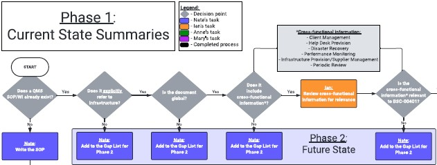

+++
date = '2026-07-07T21:45:39-07:00'
title = 'Diagrams'
+++

## Overview

Diagrams are a key component for describing complex systems and proceesses.

### Data-Flow Diagrams

Partnering with engineering leads to create technical data-flow diagrams allows the porgram team to threat model architectural designs and achieve a shared understanding of the system.

### Process Diagrams

From internal documentation processes to cross-fuctional processes, diagrams ensure all stakeholders understand the requirements, dependencies, and timing of the key process components.

